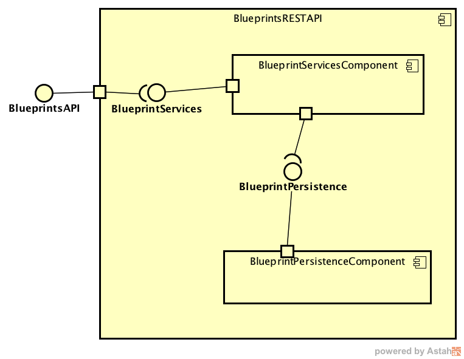

### Escuela Colombiana de Ingeniería

### Arquitecturas de Software

### Desarrollado por Laura Natalia Rojas y Ana Maria Duran
-----
### API REST para la gestión de planos.

En este ejercicio se va a construír el componente BlueprintsRESTAPI, el cual permita gestionar los planos arquitectónicos de una prestigiosa compañia de diseño. La idea de este API es ofrecer un medio estandarizado e 'independiente de la plataforma' para que las herramientas que se desarrollen a futuro para la compañía puedan gestionar los planos de forma centralizada.
El siguiente, es el diagrama de componentes que corresponde a las decisiones arquitectónicas planteadas al inicio del proyecto:



Donde se definió que:

* El componente BlueprintsRESTAPI debe resolver los servicios de su interfaz a través de un componente de servicios, el cual -a su vez- estará asociado con un componente que provea el esquema de persistencia. Es decir, se quiere un bajo acoplamiento entre el API, la implementación de los servicios, y el esquema de persistencia usado por los mismos.

Del anterior diagrama de componentes (de alto nivel), se desprendió el siguiente diseño detallado, cuando se decidió que el API estará implementado usando el esquema de inyección de dependencias de Spring (el cual requiere aplicar el principio de Inversión de Dependencias), la extensión SpringMVC para definir los servicios REST, y SpringBoot para la configurar la aplicación:


### Parte I

1. Integre al proyecto base suministrado los Beans desarrollados en el ejercicio anterior. Sólo copie las clases, NO los archivos de configuración. Rectifique que se tenga correctamente configurado el esquema de inyección de dependencias con las anotaciones @Service y @Autowired.

	

2. Modifique el bean de persistecia 'InMemoryBlueprintPersistence' para que por defecto se inicialice con al menos otros tres planos, y con dos asociados a un mismo autor.

	

3. Configure su aplicación para que ofrezca el recurso "/blueprints", de manera que cuando se le haga una petición GET, retorne -en formato jSON- el conjunto de todos los planos.
   
	* Haga que en esta misma clase se inyecte el bean de tipo BlueprintServices (al cual, a su vez, se le inyectarán sus dependencias de persistencia y de filtrado de puntos).

	

4. Verifique el funcionamiento de a aplicación lanzando la aplicación con maven:

	```bash
	$ mvn compile
	$ mvn spring-boot:run
	
	```
	Y luego enviando una petición GET a: http://localhost:8080/blueprints. Rectifique que, como respuesta, se obtenga un objeto jSON con una lista que contenga el detalle de los planos suministados por defecto, y que se haya aplicado el filtrado de puntos correspondiente.

	

5. Modifique el controlador para que ahora, acepte peticiones GET al recurso /blueprints/{author}, el cual retorne usando una representación jSON todos los planos realizados por el autor cuyo nombre sea {author}. Si no existe dicho autor, se debe responder con el código de error HTTP 404. Para esto, revise en [la documentación de Spring](http://docs.spring.io/spring/docs/current/spring-framework-reference/html/mvc.html), sección 22.3.2, el uso de @PathVariable. De nuevo, verifique que al hacer una petición GET -por ejemplo- a recurso http://localhost:8080/blueprints/juan, se obtenga en formato jSON el conjunto de planos asociados al autor 'juan' (ajuste esto a los nombres de autor usados en el punto 2).
	
	
	


6. Modifique el controlador para que ahora, acepte peticiones GET al recurso /blueprints/{author}/{bpname}, el cual retorne usando una representación jSON sólo UN plano, en este caso el realizado por {author} y cuyo nombre sea {bpname}. De nuevo, si no existe dicho autor, se debe responder con el código de error HTTP 404. 
	
	
	


### Parte II

1.  Agregue el manejo de peticiones POST (creación de nuevos planos), de manera que un cliente http pueda registrar una nueva orden haciendo una petición POST al recurso ‘planos’, y enviando como contenido de la petición todo el detalle de dicho recurso a través de un documento jSON.
   
	

	En Postman vamos a realizar la creación.

	

	Comprobamos con un get la creación.

	

2.  Para probar que el recurso ‘planos’ acepta e interpreta
    correctamente las peticiones POST, use el comando curl de Unix. Este
    comando tiene como parámetro el tipo de contenido manejado (en este
    caso jSON), y el ‘cuerpo del mensaje’ que irá con la petición, lo
    cual en este caso debe ser un documento jSON equivalente a la clase
    Cliente (donde en lugar de {ObjetoJSON}, se usará un objeto jSON correspondiente a una nueva orden:

	
 	

	


2. Teniendo en cuenta el autor y numbre del plano registrado, verifique que el mismo se pueda obtener mediante una petición GET al recurso '/blueprints/{author}/{bpname}' correspondiente.

   


4. Agregue soporte al verbo PUT para los recursos de la forma '/blueprints/{author}/{bpname}', de manera que sea posible actualizar un plano determinado.

- EL put implementado, actualizrá los puntos de un plano dado

   

- Probamos el put:

  

  

- Después de haber hecho el put verificamos los cambios:

  


### Parte III

El componente BlueprintsRESTAPI funcionará en un entorno concurrente. Es decir, atederá múltiples peticiones simultáneamente (con el stack de aplicaciones usado, dichas peticiones se atenderán por defecto a través múltiples de hilos). Dado lo anterior, debe hacer una revisión de su API (una vez funcione), e identificar:

* Qué condiciones de carrera se podrían presentar?
* Cuales son las respectivas regiones críticas?

Ajuste el código para suprimir las condiciones de carrera. Tengan en cuenta que simplemente sincronizar el acceso a las operaciones de persistencia/consulta DEGRADARÁ SIGNIFICATIVAMENTE el desempeño de API, por lo cual se deben buscar estrategias alternativas.

* Usamos Concurrent Hashmap
	

* Idenficamos una región crítica y actualizamos el código.

	

El análisis y la solución aplicada se encuentra en el archivo ANALISIS_CONCURRENCIA.txt

#### Criterios de evaluación

1. Diseño.
	* Al controlador REST implementado se le inyectan los servicios implementados en el laboratorio anterior.
	* Todos los recursos asociados a '/blueprint' están en un mismo Bean.
	* Los métodos que atienden las peticiones a recursos REST retornan un código HTTP 202 si se procesaron adecuadamente, y el respectivo código de error HTTP si el recurso solicitado NO existe, o si se generó una excepción en el proceso (dicha excepción NO DEBE SER de tipo 'Exception', sino una concreta)	
2. Funcionalidad.
	* El API REST ofrece los recursos, y soporta sus respectivos verbos, de acuerdo con lo indicado en el enunciado.
3. Análisis de concurrencia.
	* En el código, y en las respuestas del archivo de texto, se tuvo en cuenta:
		* La colección usada en InMemoryBlueprintPersistence no es Thread-safe (se debió cambiar a una con esta condición).
		* El método que agrega un nuevo plano está sujeta a una condición de carrera, pues la consulta y posterior agregación (condicionada a la anterior) no se realizan de forma atómica. Si como solución usa un bloque sincronizado, se evalúa como R. Si como solución se usaron los métodos de agregación condicional atómicos (por ejemplo putIfAbsent()) de la colección 'Thread-Safe' usada, se evalúa como B.
